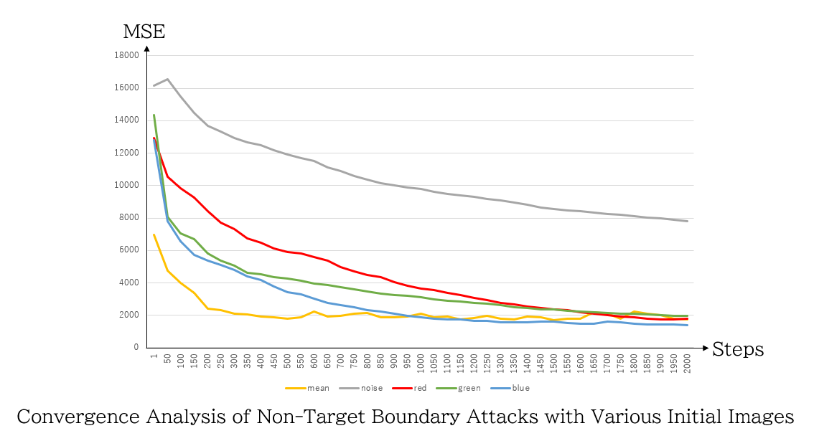

# Non-Target Boundary Attack Projects

This repository contains modified code from the original [Boundary Attack (ResNet)](https://github.com/greentfrapp/boundary-attack) to implement **Non-Target Boundary Attack**.  

The repository includes multiple experiments using different initial images for Non-Target Boundary Attack.

---

## File Descriptions

| File Name | Description |
|-----------|-------------|
| `noise_nontarget_csv.py` | Initial image is noise. Performs Non-Target Boundary Attack 2000 times. |
| `mean_nontarget_csv.py` | Initial image is a uniform image with the mean of the target image. Non-Target Boundary Attack 2000 times. |
| `red_nontarget_csv.py` | Initial image is a red uniform image. Non-Target Boundary Attack 2000 times. |
| `green_nontarget_csv.py` | Initial image is a green uniform image. Non-Target Boundary Attack 2000 times. |
| `blue_nontarget_csv.py` | Initial image is a blue uniform image. Non-Target Boundary Attack 2000 times. |
| `upgreen_mean_nontarget_csv.py` | Initial image is a uniform image with the mean of the target image and enhanced green channel. Non-Target Boundary Attack 2000 times. |
| `downgreen_mean_nontarget_csv.py` | Initial image is a uniform image with the mean of the target image and reduced green channel. Non-Target Boundary Attack 2000 times. |


---
## Installation

To run the scripts, you need the following Python packages. You can install them via pip:

```bash
pip install numpy matplotlib keras Pillow pandas opencv-python
```

## How to Run

Run with Python:

```bash
python noise_nontarget_csv.py
```


### Changing the Target Image

Modify the `target_sample` variable in the `boundary_attack()` function:

```python
target_sample = preprocess('images/original/seal.png')
```

---

## Major Modifications from Original Code

### `noise_nontarget_csv.py`
1. Changed from Target Boundary Attack → Non-Target Boundary Attack  
2. MSE is recorded in a CSV file  

### Other Files (`mean_nontarget_csv.py`, `upgreen_mean_nontarget_csv.py`, etc.)
1. Changed from Target Boundary Attack → Non-Target Boundary Attack  
2. MSE is recorded in a CSV file  
3. Added `get_sc_img(initial_sample)` function to generate uniform initial images  
4. Modified the "Move first step to the boundary" section

---

## Technology Stack
- **Language**: Python
- **Deep Learning Framework**: TensorFlow / Keras
- **Image Processing**: Pillow
- **Numerical Computation**: NumPy

## Current Issues

- Due to randomness, the Boundary Attack may fail to converge in some cases.  
- This code is modified from the Target Boundary Attack, and may contain unresolved bugs.  
- Until resolved, it is recommended to consider using alternative Non-Target Boundary Attack implementations.

---

### Experimental Results

To analyze the efficiency of the Non-Target Boundary Attack, the Mean Squared Error (MSE) between the adversarial example and the original image was measured at various steps during the attack process. The experiment was conducted using different types of initial images:

* **Noise**: A randomly generated noise image.
* **Mean**: A solid color image representing the average color of the target image.
* **Red, Green, Blue**: Solid color images.

The results are plotted in the graph below:



#### Analysis
The graph shows the convergence rate for each initial image type. A faster decrease in MSE indicates a more efficient attack starting point.

* **Most Efficient**: The **mean** color image (yellow line) consistently shows the lowest MSE, suggesting it is the most efficient starting point for the attack. It converges the fastest, requiring the least amount of perturbation to find the decision boundary.
* **Least Efficient**: The **noise** image (gray line) consistently has the highest MSE, indicating it is the least efficient starting point.
* **Color Images**: The solid **red**, **green**, and **blue** images perform similarly to each other, falling between the efficiency of the mean and noise images.

This suggests that an initial image that is closer in statistical properties (like the average color) to the target image allows the boundary attack algorithm to find a misclassification with less perturbation.

